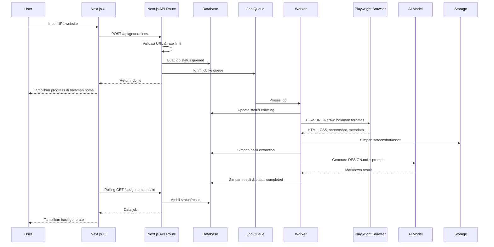
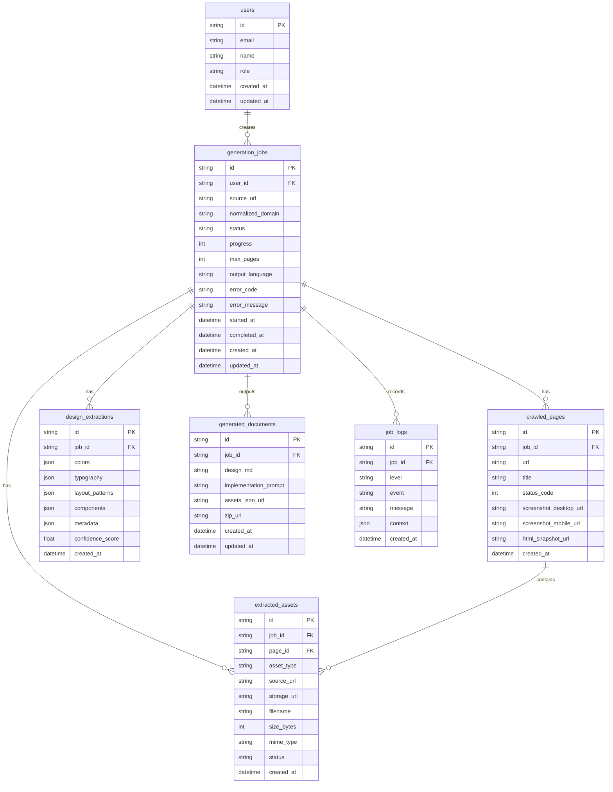

# PRD — Product Requirements Document

## Project: DesignMD Generator
**Versi:** 1.0 — Draft  
**Bahasa:** Indonesia  
**Dokumen:** Product Requirements Document  
**Catatan desain UI:** Dokumen ini **tidak menentukan detail visual UI aplikasi** seperti warna, font, logo, tone visual, atau style card/button. Seluruh keputusan desain visual aplikasi akan ditentukan oleh owner/designer.

---

## 1. Overview

DesignMD Generator adalah aplikasi web yang memungkinkan user memasukkan URL website publik, lalu sistem menganalisis website tersebut untuk menghasilkan dokumen desain teknis dalam format `DESIGN.md`, prompt implementasi untuk AI/code generator, serta daftar asset yang berhasil ditemukan dari website target.

Aplikasi ini dibuat untuk membantu developer, designer, product builder, dan indie hacker memahami struktur desain sebuah website referensi secara lebih cepat tanpa harus mengecek HTML, CSS, font, warna, layout, dan asset secara manual satu per satu.

Konsep utama aplikasi:

```txt
User memasukkan URL website
↓
Sistem mengambil screenshot, HTML, CSS, font, dan asset publik
↓
Sistem menganalisis struktur visual dan komponen UI
↓
AI menyusun DESIGN.md + prompt implementasi
↓
User dapat membaca, menyalin, mengedit, dan mengunduh hasilnya
```

---

## 2. Problem Statement

Saat membuat website baru, developer sering memakai website lain sebagai referensi desain. Namun proses menganalisis website referensi biasanya masih manual:

- membuka DevTools
- melihat struktur HTML
- mencari warna utama
- mengecek font yang digunakan
- melihat spacing dan layout
- menyimpan screenshot
- mencari asset gambar
- menulis ulang style guide
- membuat prompt untuk AI coding assistant

Proses tersebut memakan waktu dan rawan tidak konsisten. DesignMD Generator menyelesaikan masalah ini dengan mengubah satu input URL menjadi output dokumentasi desain yang lebih siap digunakan.

---

## 3. Goals

Tujuan utama aplikasi:

1. User dapat memasukkan URL website publik dan membuat job analisis.
2. Sistem dapat mengambil data website target secara terbatas dan aman.
3. Sistem dapat menghasilkan file `DESIGN.md` yang terstruktur.
4. Sistem dapat menghasilkan prompt implementasi yang bisa dipakai di AI coding assistant.
5. Sistem dapat menampilkan daftar asset yang ditemukan dari website target.
6. User dapat melihat status proses generate secara real-time atau semi-real-time.
7. User dapat menyalin dan mengunduh hasil generate.
8. Sistem dapat menangani error secara jelas tanpa membuat user bingung.

---

## 4. Non-Goals

Hal-hal berikut tidak termasuk scope MVP:

1. Membuat clone website target secara otomatis.
2. Membuat full source code website baru.
3. Menjamin hasil analisis 100% identik dengan website target.
4. Mengambil asset dari website yang membutuhkan login.
5. Membypass proteksi anti-bot, paywall, CAPTCHA, atau akses terbatas.
6. Mengambil seluruh halaman dari website besar secara mendalam.
7. Menentukan detail visual UI aplikasi DesignMD Generator seperti warna, font, dan branding.
8. Menyediakan fitur editing desain visual layaknya Figma.
9. Menyediakan fitur deployment otomatis.
10. Mengklaim asset website target bebas digunakan secara komersial.

---

## 5. Target Users

### 5.1 Primary User — Developer / Builder
User yang ingin membuat website baru dengan referensi dari website lain dan membutuhkan dokumentasi desain cepat.

Kebutuhan:
- mendapatkan `DESIGN.md`
- mendapatkan prompt implementasi
- memahami layout dan komponen website referensi
- menyalin hasil ke project coding

### 5.2 Secondary User — UI/UX Designer
User yang ingin menganalisis style website referensi untuk kebutuhan eksplorasi desain.

Kebutuhan:
- melihat ringkasan warna/font dari website target
- melihat struktur halaman
- melihat daftar asset visual
- memahami pola komponen

### 5.3 Internal Owner / Admin
Pemilik aplikasi yang perlu memantau penggunaan sistem, job gagal, error scraping, dan potensi abuse.

Kebutuhan:
- melihat jumlah job
- melihat status job
- melihat error logs
- membatasi abuse/rate limit
- menghapus job bermasalah jika diperlukan

---

## 6. Requirements

### 6.1 Functional Requirements

Sistem harus menyediakan kemampuan berikut:

1. Input URL website publik.
2. Validasi URL sebelum proses dimulai.
3. Membuat job generate dengan status yang jelas.
4. Crawl halaman secara terbatas.
5. Mengambil screenshot halaman target.
6. Mengambil HTML dan CSS yang relevan.
7. Mendeteksi warna, font, layout, komponen, dan asset dari website target.
8. Menghasilkan `DESIGN.md`.
9. Menghasilkan prompt implementasi.
10. Menampilkan preview hasil generate.
11. Menyediakan tombol copy dan download.
12. Menampilkan daftar asset yang ditemukan.
13. Menangani error seperti URL invalid, timeout, website blocked, atau AI gagal.
14. Menyimpan riwayat generate minimal selama periode yang ditentukan.
15. Menyediakan mekanisme retry untuk job gagal.

### 6.2 Technical Requirements

1. Aplikasi dibangun menggunakan **Next.js fullstack**.
2. Backend API dibuat menggunakan Next.js Route Handlers.
3. Proses berat seperti crawl, screenshot, extraction, dan AI generation dijalankan melalui background job/worker.
4. Worker boleh berada dalam repository yang sama dengan aplikasi Next.js.
5. Database digunakan untuk menyimpan job, hasil analisis, asset metadata, dan logs.
6. Storage digunakan untuk menyimpan screenshot dan asset hasil ekstraksi.
7. Browser automation menggunakan Playwright atau tool setara.
8. AI model digunakan untuk menyusun `DESIGN.md` dan prompt implementasi.
9. Sistem harus memiliki rate limiting untuk mencegah abuse.
10. Sistem harus memiliki validasi keamanan URL untuk mencegah SSRF.

### 6.3 Content Requirements

Output `DESIGN.md` minimal berisi:

1. Project summary dari website target.
2. Daftar halaman yang dianalisis.
3. Ringkasan visual style yang terdeteksi.
4. Warna yang ditemukan dari website target.
5. Typography/font yang terdeteksi dari website target.
6. Layout structure.
7. Komponen UI yang ditemukan.
8. Spacing dan border radius jika dapat dideteksi.
9. Asset yang ditemukan.
10. Catatan implementasi.
11. Confidence/limitation notes jika data tidak lengkap.

Output prompt implementasi minimal berisi:

1. Tujuan prompt.
2. Ringkasan style website target.
3. Struktur halaman yang disarankan.
4. Komponen yang perlu dibuat.
5. Batasan agar AI tidak menyalin brand secara ilegal.
6. Instruksi output untuk AI coding assistant.

---

## 7. Core Features

## 7.1 URL Analyzer

Fitur utama untuk memasukkan URL website target.

Input:
- URL website

Validasi:
- URL wajib diisi.
- URL harus memakai protokol `http://` atau `https://`.
- URL tidak boleh mengarah ke localhost, private IP, atau internal network.
- URL harus dapat diakses publik.
- Redirect dibatasi agar tidak disalahgunakan.

Output:
- Job ID
- Status awal: `queued`
- Progress/result tampil langsung di halaman home

---

## 7.2 Job Status & Progress

Setiap proses generate dijalankan sebagai job.

Status job:

| Status | Deskripsi |
|---|---|
| `queued` | Job berhasil dibuat dan menunggu diproses |
| `crawling` | Sistem sedang membuka dan membaca website |
| `capturing` | Sistem sedang mengambil screenshot |
| `extracting` | Sistem sedang mengambil data HTML, CSS, font, warna, dan asset |
| `generating` | AI sedang menyusun `DESIGN.md` dan prompt |
| `completed` | Job selesai dan hasil bisa dilihat |
| `failed` | Job gagal |
| `cancelled` | Job dibatalkan |

Halaman progress harus menampilkan:
- status saat ini
- estimasi proses jika tersedia
- pesan error jika gagal
- tombol retry jika job gagal

---

## 7.3 Limited Crawler

Crawler digunakan untuk membuka URL dan mencari halaman internal yang relevan.

MVP crawl limit:

- maksimal 5 halaman per job
- maksimal depth 1 dari URL awal
- hanya domain yang sama
- timeout per halaman
- tidak membuka halaman login, checkout, cart, account, atau halaman sensitif
- tidak mengikuti link file berbahaya atau file executable

Prioritas halaman yang dianalisis:

1. URL utama yang dimasukkan user
2. halaman yang terlihat seperti `/about`
3. halaman yang terlihat seperti `/pricing`
4. halaman yang terlihat seperti `/features`
5. halaman yang terlihat seperti `/contact`
6. halaman penting lain yang ditemukan di navigasi utama

---

## 7.4 Page Capture

Sistem mengambil bukti visual dari halaman yang dianalisis.

Data yang diambil:

- screenshot desktop
- screenshot mobile jika memungkinkan
- HTML utama
- CSS yang terhubung
- metadata halaman
- daftar link internal
- daftar image/font/script yang relevan

Batasan:

- screenshot tidak perlu pixel-perfect untuk semua ukuran layar
- sistem tidak wajib mengambil halaman yang gagal load
- sistem harus tetap melanjutkan analisis jika sebagian halaman gagal

---

## 7.5 Design Extraction

Sistem mengekstrak informasi desain dari website target.

Informasi yang dicari:

- warna dominan
- warna teks
- warna background
- warna tombol/CTA jika terdeteksi
- font family
- font weight
- ukuran heading/body jika terdeteksi
- layout pattern
- navigation pattern
- card pattern
- button pattern
- form pattern
- section structure
- spacing pattern
- border radius
- shadow/elevation jika terdeteksi
- icon/image usage

Jika data tidak dapat dideteksi, sistem harus menulis `Not detected` atau `Unknown`, bukan mengarang.

---

## 7.6 Asset Extraction

Sistem menampilkan asset publik yang ditemukan dari website target.

Asset yang dapat dicatat:

- logo image jika terdeteksi
- hero image
- illustration
- background image
- icon
- font URL
- favicon
- screenshot halaman

Data asset minimal:

- nama file atau label
- tipe asset
- source URL
- ukuran file jika tersedia
- halaman asal
- status download
- preview jika memungkinkan

Catatan:
- Sistem tidak menjamin asset bebas digunakan.
- Sistem harus memberi peringatan bahwa penggunaan asset tetap mengikuti hak cipta dan lisensi pemilik website target.

---

## 7.7 DESIGN.md Generator

Sistem menghasilkan file `DESIGN.md` berdasarkan data hasil crawl dan extraction.

Struktur output yang disarankan:

```md
# DESIGN.md

## 1. Source Website
## 2. Analysis Summary
## 3. Pages Analyzed
## 4. Visual Style Overview
## 5. Colors Detected
## 6. Typography Detected
## 7. Layout Structure
## 8. UI Components
## 9. Assets
## 10. Implementation Notes
## 11. Limitations & Confidence Notes
```

Prinsip output:

- jelas
- terstruktur
- bisa dipakai developer
- tidak terlalu panjang
- tidak mengarang data
- mencantumkan sumber halaman yang dianalisis
- memberi catatan jika hasil tidak lengkap

---

## 7.8 Implementation Prompt Generator

Selain `DESIGN.md`, sistem menghasilkan prompt untuk AI coding assistant.

Prompt harus membantu user membuat website baru dengan inspirasi dari hasil analisis tanpa harus menyalin brand target secara mentah.

Prompt minimal berisi:

- konteks project
- style reference summary
- komponen yang perlu dibuat
- layout yang perlu diperhatikan
- batasan output
- instruksi agar tidak menggunakan nama brand/logo target kecuali user punya izin
- format output yang diharapkan

---

## 7.9 Result Preview

Area hasil di halaman home menampilkan:

1. Ringkasan job
2. URL sumber
3. Status job
4. Daftar halaman yang dianalisis
5. Preview `DESIGN.md`
6. Preview prompt implementasi
7. Daftar asset
8. Tombol copy
9. Tombol download
10. Tombol retry jika gagal
11. Tombol generate ulang jika user ingin menjalankan ulang analisis

---

## 7.10 Download & Export

User dapat mengunduh:

- `DESIGN.md`
- `IMPLEMENTATION_PROMPT.md`
- screenshot halaman
- daftar asset dalam format JSON
- bundle ZIP jika tersedia

MVP minimal:
- download `DESIGN.md`
- download prompt
- copy markdown ke clipboard

---

## 7.11 Job History

Untuk MVP, riwayat dapat disimpan berdasarkan session/browser atau akun user jika auth sudah tersedia.

Data riwayat minimal:

- URL target
- tanggal generate
- status
- waktu proses
- link ke result
- jumlah halaman dianalisis

Retention:
- hasil anonymous dapat dihapus otomatis setelah periode tertentu
- hasil authenticated user dapat disimpan lebih lama sesuai kebijakan produk

---

## 7.12 Admin Monitoring

Admin/owner dapat melihat:

- daftar job terbaru
- job gagal
- error reason
- URL target
- durasi proses
- jumlah halaman yang dianalisis
- penggunaan storage
- jumlah request per IP/user

Admin tidak perlu bisa mengedit isi `DESIGN.md` user, kecuali untuk kebutuhan moderasi atau penghapusan.

---

## 8. User Flow

## 8.1 Flow Generate Baru



---

## 8.2 Flow Job Gagal

```txt
User submit URL
↓
Job dibuat
↓
Worker mencoba crawl
↓
Website timeout / blocked / invalid
↓
Status menjadi failed
↓
User melihat pesan error
↓
User dapat retry atau memasukkan URL lain
```

---

## 8.3 Flow Download Hasil

```txt
User melihat hasil di halaman home
↓
User klik Download DESIGN.md
↓
Sistem mengambil markdown dari database/storage
↓
Browser mengunduh file DESIGN.md
```

---

## 9. Information Architecture

Halaman yang dibutuhkan:

| Route | Deskripsi |
|---|---|
| `/` | Landing/input utama, progress, dan hasil generate |
| `/admin` | Monitoring internal, opsional |
| `/api/generations` | Endpoint create job |
| `/api/generations/[id]` | Endpoint detail job untuk polling di home |
| `/api/generations/[id]/download` | Endpoint download markdown dari home |
| `/api/generations/[id]/retry` | Endpoint retry job dari home |

---

## 10. API Specification

## 10.1 Create Generation Job

```http
POST /api/generations
```

Request:

```json
{
  "url": "https://example.com",
  "options": {
    "maxPages": 5,
    "includeMobileScreenshot": true,
    "outputLanguage": "id"
  }
}
```

Response success:

```json
{
  "jobId": "job_123",
  "status": "queued"
}
```

Response error:

```json
{
  "error": {
    "code": "INVALID_URL",
    "message": "URL tidak valid atau tidak dapat diproses."
  }
}
```

---

## 10.2 Get Generation Detail

```http
GET /api/generations/:id
```

Response:

```json
{
  "id": "job_123",
  "sourceUrl": "https://example.com",
  "status": "completed",
  "progress": 100,
  "pagesAnalyzed": 4,
  "result": {
    "designMd": "...",
    "implementationPrompt": "..."
  },
  "assets": []
}
```

---

## 10.3 Retry Generation

```http
POST /api/generations/:id/retry
```

Response:

```json
{
  "jobId": "job_456",
  "status": "queued",
  "retryOf": "job_123"
}
```

---

## 10.4 Download Result

```http
GET /api/generations/:id/download?type=design-md
```

Download types:

- `design-md`
- `prompt-md`
- `assets-json`
- `zip`

---

## 11. Database Schema



---

## 12. Data Dictionary

| Table | Deskripsi |
|---|---|
| `users` | Data user jika sistem menggunakan login |
| `generation_jobs` | Data utama proses generate |
| `crawled_pages` | Halaman yang berhasil dibuka dan dianalisis |
| `extracted_assets` | Asset yang ditemukan atau disimpan |
| `design_extractions` | Hasil analisis desain mentah sebelum dirapikan AI |
| `generated_documents` | Hasil akhir berupa `DESIGN.md` dan prompt |
| `job_logs` | Log proses untuk debugging dan monitoring |

---

## 13. Error Handling

Error yang harus ditangani:

| Error Code | Kondisi | Pesan User |
|---|---|---|
| `INVALID_URL` | URL kosong/tidak valid | URL tidak valid. Masukkan URL website yang benar. |
| `PRIVATE_URL_BLOCKED` | URL mengarah ke localhost/private IP | URL tidak dapat diproses karena alasan keamanan. |
| `FETCH_TIMEOUT` | Website terlalu lama merespons | Website terlalu lama merespons. Coba lagi nanti. |
| `WEBSITE_BLOCKED` | Website menolak akses crawler | Website tidak dapat diakses oleh sistem. |
| `NO_ANALYZABLE_CONTENT` | Tidak ada HTML/CSS yang cukup | Sistem tidak menemukan konten yang cukup untuk dianalisis. |
| `AI_GENERATION_FAILED` | AI gagal menghasilkan dokumen | Generate dokumen gagal. Coba ulangi proses. |
| `STORAGE_FAILED` | Gagal menyimpan screenshot/asset | Terjadi kendala saat menyimpan hasil. |
| `RATE_LIMITED` | User/IP melewati batas request | Terlalu banyak percobaan. Coba lagi beberapa saat. |

---

## 14. Security Requirements

1. URL hanya boleh memakai `http` dan `https`.
2. Sistem wajib memblokir akses ke:
   - localhost
   - `127.0.0.1`
   - `0.0.0.0`
   - private IP range
   - metadata IP cloud provider
   - internal hostname
3. Sistem wajib membatasi redirect.
4. Sistem wajib membatasi ukuran download HTML/CSS/asset.
5. Sistem wajib membatasi jumlah halaman crawl.
6. Sistem wajib memiliki timeout per request.
7. Sistem tidak boleh menjalankan file yang diunduh.
8. Sistem tidak boleh menyimpan executable dari website target.
9. Sistem wajib menggunakan rate limiting.
10. Input user harus divalidasi di client dan server.
11. Endpoint mutasi harus dilindungi dari abuse.
12. Admin endpoint harus menggunakan authentication.
13. Log tidak boleh menyimpan secret, token, cookie, atau password dari website target.
14. Cookie/session user menggunakan httpOnly jika auth diimplementasikan.
15. Sistem tidak boleh mencoba bypass login, CAPTCHA, paywall, atau proteksi anti-bot.

---

## 15. Privacy & Legal Notes

1. Sistem hanya menganalisis website publik.
2. Sistem tidak menjamin asset yang ditemukan bebas digunakan.
3. User bertanggung jawab atas penggunaan asset dari website target.
4. Sistem harus menampilkan disclaimer bahwa hasil analisis digunakan sebagai referensi.
5. Sistem tidak boleh mendorong user untuk menyalin brand, logo, atau konten pihak ketiga tanpa izin.
6. Jika website target melarang crawling atau akses otomatis, sistem harus menghormati pembatasan tersebut sesuai keputusan implementasi.

---

## 16. Performance Requirements

Target MVP:

1. Halaman utama load cepat dan tidak bergantung pada proses crawler.
2. Submit URL memberi respons awal maksimal 2 detik dalam kondisi normal.
3. Proses generate berjalan async, bukan menunggu request HTTP panjang.
4. Job MVP ideal selesai dalam 1–3 menit untuk maksimal 5 halaman, tergantung website target dan AI provider.
5. Polling status maksimal setiap 2–5 detik.
6. Area hasil di halaman home dapat membuka markdown panjang tanpa lag signifikan.
7. Sistem dapat menangani minimal 10 job bersamaan pada tahap MVP dengan queue.

---

## 17. Reliability Requirements

1. Job gagal harus menyimpan error code dan error message.
2. Job yang stuck lebih dari batas waktu tertentu harus ditandai failed.
3. Worker harus idempotent untuk mencegah duplikasi hasil saat retry.
4. Retry tidak boleh menghapus hasil job lama sampai job baru selesai.
5. Jika sebagian halaman gagal, sistem tetap membuat hasil berdasarkan halaman yang berhasil.
6. Log harus cukup untuk debugging tanpa mengekspos data sensitif.

---

## 18. Accessibility Requirements

1. Semua form memiliki label yang jelas.
2. Error form tampil dekat field terkait.
3. Tombol utama dapat diakses via keyboard.
4. Preview markdown dapat dibaca dengan baik oleh screen reader.
5. Status progress tidak hanya mengandalkan warna.
6. Toast/notification tidak menjadi satu-satunya sumber informasi penting.
7. UI responsive untuk mobile, tablet, dan desktop tanpa menentukan detail visual spesifik.

---

## 19. Technical Constraints

1. Stack utama: Next.js fullstack.
2. Tidak perlu NestJS untuk MVP.
3. Worker/background job tetap boleh berada dalam monorepo Next.js.
4. Database disarankan relational karena data job, page, asset, dan document saling berhubungan.
5. Storage eksternal dibutuhkan untuk screenshot dan asset.
6. AI provider harus bisa diganti melalui abstraction layer.
7. Scraper/browser automation harus dibatasi resource-nya agar tidak boros biaya.
8. Detail UI visual aplikasi tidak ditentukan di dokumen ini.

---

## 20. MVP Scope

Fitur wajib MVP:

1. Input URL.
2. Validasi URL aman.
3. Job queue.
4. Crawl maksimal 5 halaman.
5. Screenshot desktop.
6. Extract HTML/CSS/basic asset.
7. Generate `DESIGN.md`.
8. Generate implementation prompt.
9. Preview result.
10. Copy markdown.
11. Download markdown.
12. Error handling.
13. Basic rate limit.
14. Basic admin/job logs.

---

## 21. Phase 2 Scope

Fitur yang bisa ditambahkan setelah MVP:

1. Login user.
2. Project folders.
3. Riwayat generate permanen.
4. Compare dua website.
5. Export ZIP lengkap.
6. Export ke Figma-ready notes.
7. Custom output template.
8. Pilihan bahasa output.
9. Pilihan tech stack prompt.
10. Batch URL analysis.
11. Public share link.
12. Team workspace.
13. Payment/subscription.
14. Advanced crawl rules.
15. AI chat dengan hasil analisis.

---

## 22. Risks & Mitigations

| Risiko | Dampak | Mitigasi |
|---|---|---|
| Website target memblokir crawler | Generate gagal | Tampilkan error jelas dan tombol retry |
| Proses AI mahal | Biaya tinggi | Batasi max page dan panjang input |
| Asset terlalu banyak | Storage membengkak | Limit ukuran dan jumlah asset |
| SSRF dari input URL | Risiko keamanan tinggi | Validasi URL, DNS, IP, redirect |
| Hasil AI mengarang | Output tidak dipercaya | Pakai data extraction, confidence notes, unknown state |
| Job timeout | UX buruk | Gunakan queue dan status async |
| Copyright asset | Risiko legal | Tampilkan disclaimer dan jangan klaim asset bebas pakai |

---

## 23. Success Metrics

1. User berhasil membuat job dari URL valid.
2. Minimal 80% URL publik sederhana berhasil menghasilkan `DESIGN.md`.
3. Rata-rata user dapat melihat status job tanpa refresh manual.
4. User dapat mengunduh hasil dalam format markdown.
5. Error URL invalid/blocked dapat dipahami user.
6. Tidak ada job yang stuck tanpa status final.
7. Admin dapat melihat job gagal dan penyebabnya.
8. Sistem tidak memproses private/internal URL.

---

## 24. Definition of Done

Fitur dianggap selesai jika:

1. Semua acceptance criteria terkait terpenuhi.
2. Validasi client-side dan server-side berjalan.
3. Job async berjalan sampai status final.
4. Hasil `DESIGN.md` dan prompt bisa ditampilkan.
5. Download file markdown berhasil.
6. Error state diuji.
7. Rate limit dasar aktif.
8. SSRF protection dasar aktif.
9. UI responsive tanpa menentukan detail warna/font spesifik.
10. Tidak ada bug critical/high terbuka.
11. Dokumentasi setup developer tersedia.
12. Testing minimal untuk API utama dan worker tersedia.
